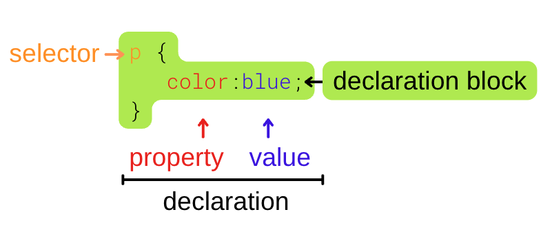
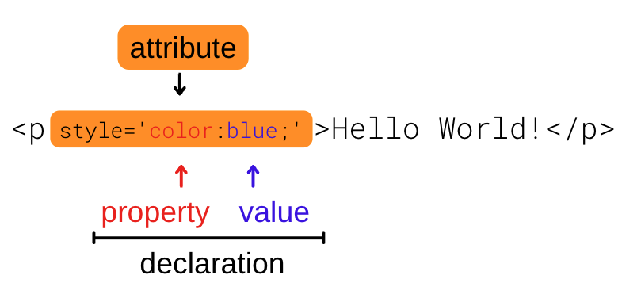

#Anatomy 

The anatomy of CSS style syntax applies to the two methods of incorporating CSS into a web-page:

* Rulesets: A ruleset is defined within either the HTML document itself, or in one or more separate files (known as stylesheets) that use the .css extension.

* Inline styles: An inline style is set in a style attribute and applies to individual HTML elements directly.


While inline styles are directly applied to a single element, rulesets can define multiple styles across multiple elements. Another key difference between the two is that a ruleset can utilize id and class selectors to identify targeted elements, as well as designating children of specific parent-elements.

Inline styles are commonly used for situations such as the following:
* The style being applied in the markup is unique and won’t be repeated.
* The HTML markup is dynamically generated and the CSS stylesheet is static.
* Other situations where it isn’t advisable (or possible) to edit the stylesheet(s) for a page.

### Syntax
Rulesets use the following syntax for selecting and styling any and every instance of an existing element:

```
/* Start of Ruleset */
selector:pseudo-class::pseudo-element {

  /* Declaration */
  property: value-or-keyword;

}
/* End of Ruleset */
```

Conversely, inline styles apply a visually-similar syntax to a single element:

```
<element style="property:value;">Hello World!</element>
```

### Anatomy
There are several parts to the CSS in both the ruleset and the inline-style:





In the ruleset example above, the initial `p` is a selector that can be applied to any and every valid instance of that element. Selectors possess a wide range of specificity, including:

* General selection by HTML element name.
* Specific `class` and `id` selectors for elements.
* Pseudo-class and pseudo-element selectors.
* Reserved keyword rules like `!important` and `@media`.


Next in the ruleset syntax is the block of declarations between the two braces `{...}`. This is the block of code that defines the style that will be applied. This is equivalent to the style attribute value in the inline-style example.


The declaration block, or attribute value, is made up of one or more declarations. In the examples, `color:blue`; is a declaration. A declaration is made up of a CSS property name, followed by a colon (`color:`) then a value, followed by a semicolon, (`blue;`).

For either syntax, there can be an arbitrary number of declarations. While whitespace has no effect, ruleset declarations are usually set on their own lines while inline style declarations are all placed on the same line.


