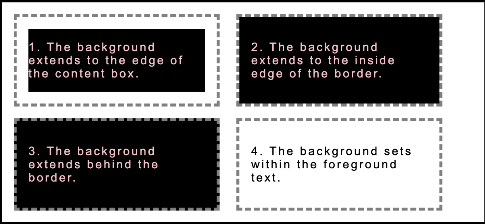

# Background
The CSS `background` properties are used to add background wallpaper visuals for HTML elements.

### `background`
Shorthand way of expressing the various background properties of one or more element backgrounds in any order using a single declaration.
```
background: <value>;
```

where `<value>` can be any of the following:
* Attachment value: scroll, fixed
* Blend mode value: dark, light
* Clip value: content-box, padding-box, border-box
* Color value: rgba(255, 0, 255, 0.3)
* Image value: url('cat.png')
* Origin value: content-box, padding-box, border-box
* Position value: top, 50% 50%
* Repeat value: repeat, repeat-x, round
* Size value: contain, cover

Sets `rebeccapurple` as the background color:

```
body {
  background: rebeccapurple;
}
```

Specifies the background-color, the background-image property to set the image to the background, background-repeat to specify the image to not be repeated, background-attachment to specify the image to be fixed and background-position to specify the image to be in center:

```
body {
  background: blue url('whale.png') no-repeat fixed center;
}
```

### `background-attachment`
Determines if the background image is fixed in relationship to the viewport or whether it will scroll along with the rest of the page.
```
background-attachment: <value>;
```
Where `<value>` can be the following: `scroll` | `fixed` | `local` | `initial` | `inherit`
* `scroll` is the default value. The background image will scroll with the page.
* `fixed` will cause the background image to stay in the same position on the page.
* `local` will result in the background image scrolling within the elements contents.


Set background image to be fixed to the viewport:
```
body {
  height: 1200px;
  background-image: url('fish.png');
  background-repeat: no-repeat;
  background-size: 400px 100px;
  background-attachment: fixed;
}
```

Set background to scroll with the page:
```
body {
  height: 1200px;
  background-image: url('fish.png');
  background-repeat: no-repeat;
  background-size: 400px 100px;
  background-attachment: scroll;
}

```

### `background-blend-mode`
Returns a new blended color based on the background color and the background images.
```
background-blend-mode: <value>;
```
where `<value>` can be one of the following: `normal` | `multiply` | `screen` | `overlay` | `darken` | `lighten` | `color-dodge` | `color-burn` | `hard-light` | `soft-light` | `difference` | `exclusion` | `hue` | `saturation` | `color` | `luminosity`

* `normal` is the default value which imposes simple alpha blending, as CSS has permitted since its inception.

* `lighten` means that the final result will show, at each pixel, either the image or its backdrop, whichever is lighter.

* `darken` will show, at each pixel, whichever is darker.

The background color will not bleed through the background image:
```
body {
  background-image: url('fish.jpg');
  background-color: blue;
  background-blend-mode: normal;
}
```
At each pixel, show whichever is lighter between the background image and the background color:

```
body {
  background-image: url('fish.jpg');
  background-color: blue;
  background-blend-mode: lighten;
}
```

At each pixel, show whichever is darker between the background image and the background color:
```
body {
  background-image: url('fish.jpg');
  background-color: blue;
  background-blend-mode: darken;
}
```

### `background-clip`
Defines the boundary within the element box at which the background is no longer drawn.

```
background-clip: <value>;
```
Where `<value>` can be the following: `border-box` | `content-box` | `padding-box` | `text` | `initial`

Set background to the edge of the content box:
```
body {
  background: #000000;
  border: 5px dashed grey;
  padding: 20px;
  background-clip: content-box;
}
```

Set background to the inside edge of the border:
```
body {
  background: #000000;
  border: 5px dashed grey;
  padding: 20px;
  background-clip: padding-box;
}
```

Set background to the edge of the border:
```
body {
  background: #000000;
  border: 5px dashed grey;
  padding: 20px;
  background-clip: border-box;
}
```

Set background within the foreground text:
```
body {
  background: #000000;
  border: 5px dashed grey;
  padding: 20px;
  background-clip: text;
  color: transparent;
}
```



### `background-color`
The `background-color` property defines a color for the background of an HTML element.

```
background-color: <value>;
```
Where `<value>` can be one of the following:
* Color keyword: blue, transparent, rebeccapurple
* Hexadecimal value: `#FF0000`
* RGB value: `rgb(255, 0, 0)`
* RGBA value: `rgba(255, 0, 255, 0.3)`
* HSL value: `hsl(0, 100%, 50%)`
* HSLA value: `hsla(180, 80%, 100%, 0.8)`
* Special keyword values: `currentColor`, `transparent`

Set background color of the `h1` element to be green:
```
h1 {
  background-color: green;
}
```

### `background-image`
Places one or more images in the background of the element.
```
background-image: <image> | none;
```
Where `<image>` can be one of the following:
* URL function value:
    * ('cat.gif')
    * ('../img/cat.png')
* Gradient values:
    * linear-gradient(0deg, #C1D279, #4062BF)
    * repeating-linear-gradient(0deg, #1D4D19, #191A4D 10px)
    * radial-gradient(circle at top, #40BFA5, #BB40BF)
    * repeating-radial-gradient(#1D4D19, #191A4D 10px)

Multiple background images are supported. The first value specified will be stacked on top.

```
background-image: <image>, <image>;

```
Note: The background-color property should always be set in case the image is unavailable.

Set background image on the `.hero` class element as a linear gradient starting with yellow at the top and purple at the bottom:
```
.hero {
  background-image: linear-gradient(yellow, purple);
}
```

Set two background images with a fallback background color of blue. The fish.png should be sitting on top of the ocean.png:

```
.hero {
  background-color: blue;
  background-image: url('fish.png'), url('ocean.png');
}
```
