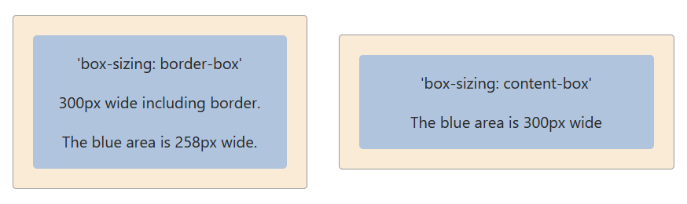

# Box Sizing

The `box-sizing` property allows us to include the padding and border in the calculation of an element’s height and width.

```
box-sizing: value;
```

The value for `box-sizing` property can be one of the following:

* border-box: Any assigned padding or border is included in the calculation of the height or width of an element. If an element’s width is set to `100px` and padding is set to `30px`, the padding will be included in the element’s set width resulting in the total width still being 100px.

* content-box: Default CSS behavior, the assigned height or width of an element plus any padding will be the total height or weight. If an element’s width is set to `100px` and padding is set to `50px`, the total width for the element will be 150px.

Setting a `div` elements box-sizing to `border-box`:
```
.div {
  box-sizing: border-box;
}
```

Setting a `div` elements box-sizing to `content-box`:
```
.div {
  box-sizing: content-box;
}
```

