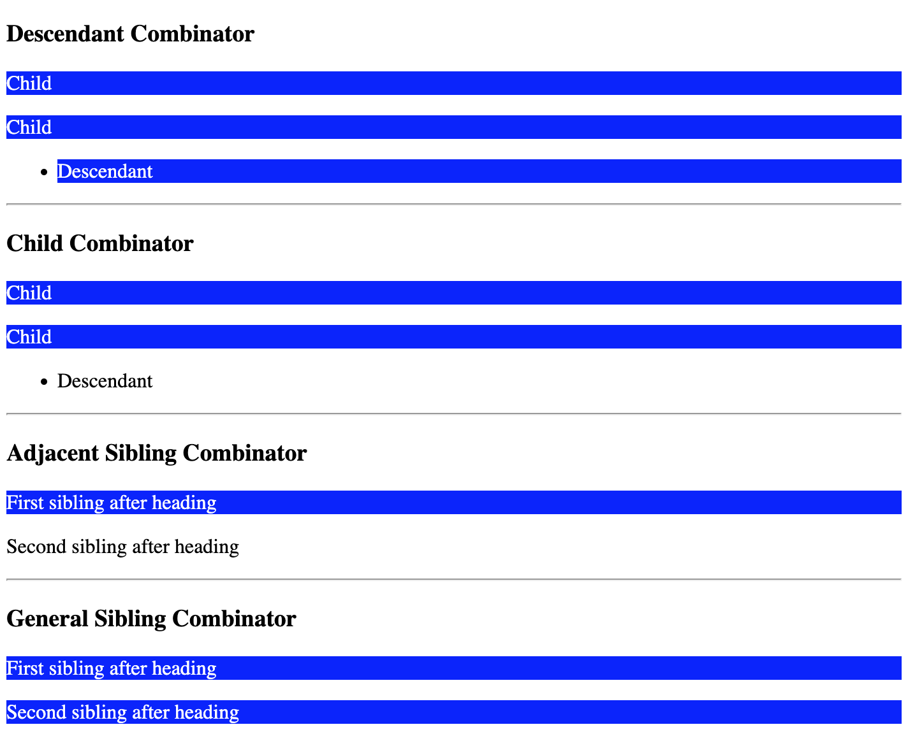

# Combinators

Combinators are CSS selectors that are used to style elements that have a certain relationship with other selected elements.

### Syntax
```
selector1 selector2 ... selectorN {
  /* declarations here */
}

selector1 > selector2 ... > selectorN {
  /* declarations here */
}

selector1 + selector2 ... + selectorN {
  /* declarations here */
}

selector1 ~ selector2 ... ~ selectorN {
  /* declarations here */
}
```

* The space selector (` `) matches all descendants of a specified element.
* The child selector (`>`) matches all children of a specified element.
* The adjacent sibling selector (`+`) matches all elements directly after the preceding element.
* The general sibling selector (`~`) matches all elements that are next to the preceding element.

### Example
The example below shows how these combinators can be used:
```
div p {
  background-color: blue;
  color: #fff;
}

div > p {
  background-color: blue;
  color: #fff;
}

h3 + p {
  background-color: blue;
  color: #fff;
}

h3 ~ p {
  background-color: blue;
  color: #fff;
}
```
The rendered output may look like this:

