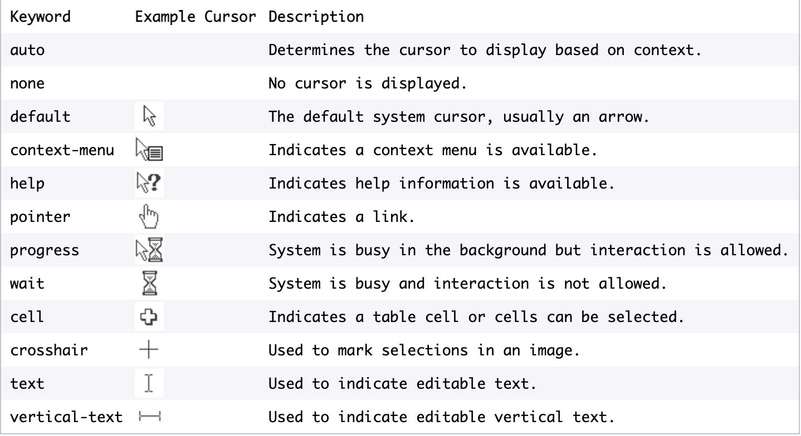

# cursor
The `cursor` property sets the appearance of the mouse cursor when hovering over an element. The appearance can be set by specifying the type of cursor, or by loading a specific icon. When using an icon, fallback images can be used, ending with a mandatory keyword fallback.

```
cursor: keyword;
```

It can also accept one or more URLs:
```
cursor: url(cursor_image), url(fallback_cursor_image), keyword;

```
If the primary `cursor_image` fails to load, an optional `fallback_cursor_image` can be applied instead. However, in case all the image URLs fail to load, the mandatory keyword will be used as a last resort.

These are some common keywords used to specify the type of cursor to display:


```
<p style="cursor: pointer;">The cursor is pointing at this paragraph!</p>
```