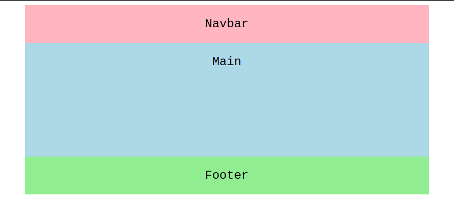
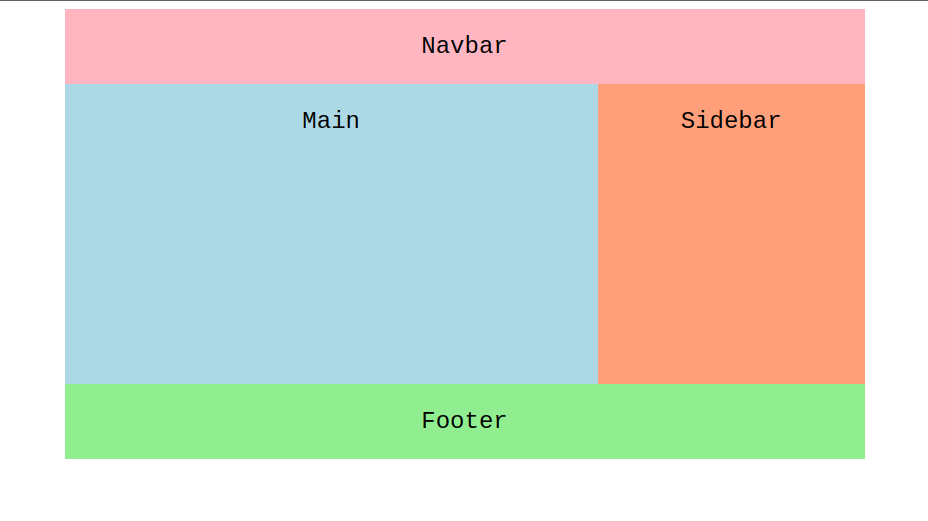

# Grids
CSS Grid is a two-dimensional grid-based layout system that uses rows, columns, and gaps to organize content on a web page. This system helps with creating a responsive layout for web pages without having to use positioning, floats, or flexbox.

### Grid Elements
A grid layout consists of a parent element, with one or more child elements.
```
<div class="grid-container">
  <div class="grid-item">1</div>
  <div class="grid-item">2</div>
  <div class="grid-item">3</div>
  <div class="grid-item">4</div>
</div>

```
An HTML element becomes a grid container when its display property is set to grid or inline-grid:

```
.grid-container {
  display: grid;
}
```
All the nested elements inside the grid container element are called grid items. In the example above, each item is given a class of grid-item to further emphasize this point.

The difference between the values `inline-grid` and `grid` is that the `inline-grid` will make the element `inline` while `grid` will make it a block-level element.

* Grid columns are the vertical lines of the grid items.
* Grid rows are the horizontal lines of grid items.
* Grid gaps are the spaces between each column/row.

## grid-template-columns
A property that specifies the column structure of a grid container.

### Syntax
```
.grid-container {
  display: grid;
  grid-template-columns: <column-space> <column-space>;
}
```
where <column-space> can be one of the following:
* Grid keyword: `auto`, `minmax()`
* Pixel value: `300px`
* Percent value: `25%`
* Fractional unit value: `1fr`

### Example
The spam-container div encloses several paragraphs of text, split the container into four evenly spaced columns:
```
.spam-container {
  display: grid;
  grid-template-columns: 1fr 1fr 1fr 1fr;
  /* equivalent to: 25% 25% 25% 25% */
}
```

Create left and right columns that adjust to fill the width available and a middle column that has a minimum width of 400 pixels and a max of 1000 pixels:

```
.eggs-container {
  display: grid;
  grid-template-columns: auto minmax(400px, 1000px) auto;
}
```

## grid-template-rows
A property that specifies the row structure of a grid container.
### Syntax
```
.grid-container {
  display: grid;
  grid-template-rows: <row-space> <row-space>;
}
```
where `<row-space>` can be one of the following:
* Grid keyword: `auto`, `minmax()`, `repeat()`
* Pixel value: `300px`
* Percent value: `25%`
* Fractional unit value: `1fr`

### Example
A div split into three sections (e.g. header, main, footer).
```
.spam-container {
  display: grid;
  grid-template-rows: 15% 70% 15%;
}
```

Six equally sized columns that utilize the available space:

```
.eggs-container {
  display: grid;
  grid-template-rows: repeat(6, auto);
}
```

### grid-template-areas
The grid-template-areas property defines a CSS grid by assigning a grid-area name to each element in the template. The grid-template property can be used as a shorthand to define the areas as well as defining the sizes of the columns and rows. This property is collectively used with grid-template-columns and grid-template-rows under the grid-template shorthand property.

### Syntax
```
.item-one {
  grid-area: nav;
}

.item-two {
  grid-area: main;
}

.item-three {
  grid-area: footer;
}

.grid-container {
  display: grid;
  grid-template-areas:
    'nav     nav    nav'
    'main    main   main'
    'footer footer footer';
}
```
Each grid item can be assigned a name with the `grid-area` property. Then, the `grid-template-areas` utilizes these areas in the grid container. For these properties to work, `display: grid` must be set in the `.grid-container`.



### Example
By using `grid-template-areas`, it is not required to specify anything on the individual grid items except for assigning the name of the corresponding area. Everything else happens on the grid container.
```
.item-one {
  grid-area: nav;
  background-color: lightpink;
}

.item-two {
  grid-area: main;
  background-color: lightblue;
}

.item-three {
  grid-area: footer;
  background-color: lightgreen;
}

.item-four {
  grid-area: sidebar;
  background-color: lightsalmon;
}

.grid-container {
  display: grid;
  max-width: 800px;
  margin: 0 auto;
  grid-template-columns: repeat(3, 1fr);
  grid-template-rows: repeat(4, 1fr 3fr 1fr 1fr);
  grid-template-areas:
    'nav    nav      nav'
    'main  main    sidebar'
    'main  main    sidebar'
    'footer footer footer';
}
```


## grid-template
A shorthand for the grid-template-row, column and areas properties. The grid-template syntax allows for a condensed specification of a grid structure and the location of elements.

### Syntax
```
.grid-container {
  display: grid;
  grid-template: <grid-value>;
}
```
A `<grid-value>` can be one of the following:
* Grid keyword: `auto`, `minmax()`, `repeat()`
* Pixel value: `300px`
* Percent value: `25%`
* Fractional unit value: `1fr`
* A string: `'header'`

Common syntax patterns:

* `<area value>` `<row value>` / `<col value>`
* `<row value>` / `<col value>`
* `<area value>`

### Example
A grid with three rows and five columns:
```
#eggs-container {
  display: grid;
  grid-template: 10% 80% 10% / auto 300px 300px 300px auto;
}
```

### column-gap, row-gap, grid-column-gap, grid-row-gap
Specifies the size of the grid lines. You can think of it like setting the width of the gutters between the columns/rows.

### Syntax 
```
.container {
  /* standard */
  column-gap: <gap-value>;
  row-gap: <gap-value>;

  /* old */
  grid-column-gap: <gap-value>;
  grid-row-gap: <gap-value>;
}
```
A `<gap-value>` can be one of the following:
* Grid keyword: `auto`
* Pixel value: `20px`
* A percentage: `1%`

### Example
Columns with five pixels of buffer between each:
```
.content-a-container {
  display: grid;
  grid-auto-columns: 20%;
  column-gap: 5px;
}
```

## gap, grid-gap
Specifies the spacing between grid elements within a grid framework.
### Syntax
```
.container {
  /* standard */
  gap: <gap-value> <gap-value>;

  /* old */
  grid-gap: <gap-value> <gap-value>;
}
```
A `<gap-value>` can be one of the following:
* Grid keyword: `auto`
* Pixel value: `20px`
* A percentage: `1%`

### Example
Columns with three pixels of spacing:
```
.content-a-container {
  display: grid;
  grid-template: 150px 300px 150px / 1fr 1fr 1fr;
  grid-gap: 3px;
}
```

## justify-items
Aligns grid items along the inline (row) axis (as opposed to align-items which aligns along the block (column) axis). This value applies to all grid items inside the container.

### Syntax
```
.container {
  justify-items: <justify-value>;
}
```

A `<justify-value>` can be one of the following:
* `start` – aligns items to be flush with the start edge of their cell
* `end` – aligns items to be flush with the end edge of their cell
* `center` – aligns items in the center of their cell
* `stretch` – fills the whole width of the cell (this is the default)

### Example
```
.container {
  justify-items: start;
}
```

## align-items
Aligns grid items along the block (column) axis (as opposed to justify-items which aligns along the inline (row) axis). This value applies to all grid items inside the container.
### Syntax
```
.container {
  align-items: <align-value>;
}
```
A `<align-value>` can be one of the following:
* `stretch` – fills the whole height of the cell (this is the default)
* `start` – aligns items to be flush with the start edge of their cell
* `end` – aligns items to be flush with the end edge of their cell
* `center` – aligns items in the center of their cell
* `baseline` – align items along text baseline. There are modifiers to baseline — first baseline and last baseline which will use the baseline from the first or last line in the case of multi-line text.

### Example
```
.container {
  align-items: start;
}
```

## place-items
`place-items` sets both the `align-items` and `justify-items` properties in a single declaration.
### Syntax
```
.container {
  place-items: <align-items> / <justify-items> ;
}
```
`<align-items>` / `<justify-items>` – The first value sets align-items, the second value justify-items. If the second value is omitted, the first value is assigned to both properties.

### Example
```
.center {
  display: grid;
  place-items: center;
}
```

## justify-content
Sometimes the total size of your grid might be less than the size of its grid container. This could happen if all of your grid items are sized with non-flexible units like px. In this case you can set the alignment of the grid within the grid container. This property aligns the grid along the inline (row) axis (as opposed to align-content which aligns the grid along the block (column) axis).

### Syntax
```
.container {
  justify-content: <justify-content-value>;    
}
```
The `<justify-content-value>` can be one of the following options:
* `start` – aligns the grid to be flush with the start edge of the grid container
* `end` – aligns the grid to be flush with the end edge of the grid container
* `center` – aligns the grid in the center of the grid container
* `stretch` – resizes the grid items to allow the grid to fill the full width of the grid container
* `space-around` – places an even amount of space between each grid item, with half-sized spaces on the far ends
* `space-between` – places an even amount of space between each grid item, with no space at the far ends
* `space-evenly` – places an even amount of space between each grid item, including the far ends

### Example
```
.container {
  justify-content: start;
}
```

## align-content
Sometimes the total size of your grid might be less than the size of its grid container. This could happen if all of your grid items are sized with non-flexible units like px. In this case you can set the alignment of the grid within the grid container. This property aligns the grid along the block (column) axis (as opposed to `justify-content` which aligns the grid along the inline (row) axis).

```
.container {
  align-content: <align-content-value>;    
}
```
The `<align-content-value>` can be one of the following options:
* `start` – aligns the grid to be flush with the start edge of the grid container
* `end` – aligns the grid to be flush with the end edge of the grid container
* `center` – aligns the grid in the center of the grid container
* `stretch` – resizes the grid items to allow the grid to fill the full width of the grid container
* `space-around` – places an even amount of space between each grid item, with half-sized spaces on the far ends
* `space-between` – places an even amount of space between each grid item, with no space at the far ends
* `space-evenly` – places an even amount of space between each grid item, including the far ends

### Example
```
.container {
  align-content: stretch;    
}
```

## place-content
place-content sets both the `align-content` and `justify-content` properties in a single declaration.

## grid-auto-columns
A property that specifies the default column size(s) for a container.
### Syntax
```
.grid-container {
  display: grid;
  grid-auto-columns: <col-value>;
}
```
where `<col-value>` can be one of the following:
* Grid keyword: `auto`, `maxcontent`, `minmax()`
* Pixel value: `300px`
* Percent value: `25%`
* Fractional unit value: `1fr`

### Example
A container divided into evenly spaced columns with a minimum width of 100 pixels:
```
.content-a-container {
  display: grid;
  grid-auto-columns: minmax(100px, auto);
}
```

## grid-auto-rows
A property that specifies the default row size(s) for a container.
### Syntax
```
.grid-container {
  display: grid;
  grid-auto-rows: <row-value>;
}
```
where `<row-value>` can be one of the following:
* Grid keyword: `auto`, `maxcontent`, `minmax()`
* Pixel value: `300px`
* Percent value: `25%`
* Fractional unit value: `1fr`

### Example
A container with alternating rows of 200 and 400 pixels:
```
.content-a-container {
  display: grid;
  grid-auto-rows: 200px 400px;
}
```
## grid 
The grid property is a shorthand for setting the following properties:
* grid-template-rows
* grid-template-columns
* grid-template-areas
* grid-auto-rows
* grid-auto-columns
* grid-auto-flow

### Syntax
```
grid: <grid-template-rows> / <grid-template-columns>;

grid: <grid-template-areas>;

grid: <grid-template-rows> / <grid-auto-columns>;

grid: <grid-auto-rows> / <grid-template-columns>;

grid: <grid-template-rows> / <grid-auto-flow> <grid-auto-columns>;

grid: <grid-auto-flow> <grid-auto-rows> / <grid-template-columns>;
```

### Properties for the Children (Grid Items)
## grid-column-start
A property that specifies the start of a content span over a set of columns within a grid framework.
### Syntax
```
.some-text {
  grid-column-start: <grid-value>;
}
```
where `<grid-value>` can be one of the following:
* Grid keyword: auto
* Grid line value: 1
* Grid line name: main-content-start

### Example
Content that spans three columns, beginning at the second column:
```
.bar-text {
  grid-column-start: 2;
  grid-column-end: 5;
}
```

## grid-column-end
Specifies the end of a content span over a set of columns within a grid framework.

## grid-row-start
A property that specifies the start of a content span over a set of rows within a grid framework.

## grid-row-end
Specifies the end of a content span over a set of rows within a grid framework.

## grid-column grid-row
Shorthand for `grid-column-start` + `grid-column-end`, and `grid-row-start` + `grid-row-end`, respectively.

## grid-area
A property used to identify an element within a grid template or specify the location of an element within a grid.
### Syntax
```
.item-one {
  grid-area: <area-value>;
}
```
A `<area-value>` can be any of the following:
* Grid keyword: `auto`, `span`
* Grid line value: `2`
* Grid line name: `section-a-start`
* A string: `'header'`

Values for a location can also be specified as:
```
.item-one {
  grid-area: row-start / column-start / row-end / column-end;
}
```
### Example
A `div` named `banner` which may be referenced within `grid-template-areas`:
```
#banner-div {
  grid-area: banner;
}
```

## justify-self
Aligns a grid item inside a cell along the inline (row) axis (as opposed to align-self which aligns along the block (column) axis). This value applies to a grid item inside a single cell.

### Syntax
```
.container {
  justify-self: <justify-value>;
}
```

A `<justify-value>` can be one of the following:
* `start` – aligns items to be flush with the start edge of their cell
* `end` – aligns items to be flush with the end edge of their cell
* `center` – aligns items in the center of their cell
* `stretch` – fills the whole width of the cell (this is the default)

### Example
```
.container {
  justify-self: start;
}
```

## align-self
Aligns a grid item inside a cell along the block (column) axis (as opposed to justify-self which aligns along the inline (row) axis). This value applies to the content inside a single grid item.

### Syntax
```
.container {
  align-self: <align-value>;
}
```

A `<align-value>` can be one of the following:
* `start` – aligns items to be flush with the start edge of their cell
* `end` – aligns items to be flush with the end edge of their cell
* `center` – aligns items in the center of their cell
* `stretch` – fills the whole width of the cell (this is the default)

### Example
```
.container {
  align-self: start;
}
```

## place-self
`place-self` sets both the `align-self` and `justify-self` properties in a single declaration.


## Special Units & Functions
### fr units
You’ll likely end up using a lot of fractional units in CSS Grid, like 1fr. They essentially mean “portion of the remaining space”. So a declaration like:
```
grid-template-columns: 1fr 3fr;
```

Means, loosely, 25% 75%. Except that those percentage values are much more firm than fractional units are. For example, if you added padding to those percentage-based columns, now you’ve broken 100% width (assuming a content-box box model). Fractional units also much more friendly in combination with other units, as you can imagine:

```
grid-template-columns: 50px min-content 1fr;
```

## Sizing Keywords
When sizing rows and columns, you can use all the lengths you are used to, like px, rem, %, etc, but you also have keywords:

* `min-content`: the minimum size of the content. Imagine a line of text like “E pluribus unum”, the min-content is likely the width of the word “pluribus”.
* `max-content`: the maximum size of the content. Imagine the sentence above, the max-content is the length of the whole sentence.
* `auto`: this keyword is a lot like fr units, except that they “lose” the fight in sizing against fr units when allocating the remaining space.
* Fractional units: see above

## Sizing Functions
* The `fit-content()` function uses the space available, but never less than min-content and never more than max-content.
* The `minmax()` function does exactly what it seems like: it sets a minimum and maximum value for what the length is able to be. This is useful for in combination with relative units. Like you may want a column to be only able to shrink so far. This is extremely useful and probably what you want:
`grid-template-columns: minmax(100px, 1fr) 3fr;`
* The `min()` function.
* The `max()` function

## The repeat() Function and Keywords
The `repeat()` function can save some typing:
```
grid-template-columns:
  1fr 1fr 1fr 1fr 1fr 1fr 1fr 1fr;

/* easier: */
grid-template-columns:
  repeat(8, 1fr);

/* especially when: */
grid-template-columns:
  repeat(8, minmax(10px, 1fr));
```

But `repeat()` can get extra fancy when combined with keywords:
* `auto-fill`: Fit as many possible columns as possible on a row, even if they are empty.
* `auto-fit`: Fit whatever columns there are into the space. Prefer expanding columns to fill space rather than empty columns.

This bears the most famous snippet in all of CSS Grid and one of the all-time great CSS tricks:
```
grid-template-columns: repeat(auto-fit, minmax(250px, 1fr));
```


