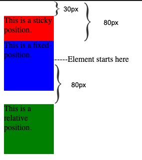

# Position
Positioning in CSS provides designers and developers options for positioning HTML elements on a web page.

The CSS position can be set to `static`, `relative`, `absolute`, or `fixed` or `sticky`.


The `position` property defines how elements are placed within the document.

```
position: <value>;
```

where `<value>` can be one of the following:
* `static`: This is the default value of the position property. The element stays in the flow of the document and appears in the actual location where it’s located in the markup.
* `relative`: The element does not change positions unless one or several properties of top, right, bottom, or left are declared. It also creates a reference position for absolute positioned child elements.
* `absolute`: The element is removed from the document flow and it’s positioned in relation to its closest relative positioned ancestor element.
* `fixed`: The element is removed from the document flow just like the absolute positioned elements. However, unlike the absolute positioned elements, which are relative to an ancestor element, the fixed elements are always relative to the document.
* `sticky`: This value is a mix between the relative and fixed positions. The element is treated as relative until a specific point or threshold is met, at which point the element is then treated as fixed.

The following example features three `.box` elements with different position values:

```
.box1 {
  height: 100px;
  width: 100px;
  background-color: red;
  position: sticky;
  top: 30px;
}

.box2 {
  height: 100px;
  width: 100px;
  background-color: blue;
  position: fixed;
  top: 80px;
}

.box3 {
  height: 100px;
  width: 100px;
  background-color: green;
  position: relative;
  top: 80px;
}
```

The first box is sticky to the top of the document. The second is set to a fixed position 40px from the top of the page. The third box position is 80px from the element’s top edge.


### `z-index`
The `z-index` sets the stack order of an element.
```
z-index: <value>;
```
The `z-index` value can be specified with a positive or negative integer. An element with a larger `z-index` value will be higher on the stack than an element with a lower `z-index` value. Unless specified, the default value of an element on the stack is `0`.

Note: The `z-index` property does not work with an element that has a position value of static.

In the following example, we have a gray box and a black box. We can set the gray box above the black box by giving the gray box a higher `z-index` value.

```
.graybox {
  z-index: 2;
}

.blackbox {
  z-index: 1;
}
```

### `bottom`
Specifies the distance of an element from the bottom of its current location if the element itself has `position: relative` declared or from the bottom of its nearest ancestor when the ancestor has `position: relative` and the element has position: `absolute` declared.

```
bottom: <value>;
```

where `<value>` can be one of the following:
* Length value: `20px`
* Percentage value: `5%`
* Keyword value: `auto`, `inherit`

Note: If none of the ancestors have position: relative declared, the absolute positioned element will traverse the DOM until it reaches the root element.

Set the position of `.box` element `40px` from the bottom of the nearest relative position ancestor or from the document if none exist.
```
.box {
  height: 100px;
  width: 100px;
  background-color: blue;
  position: absolute;
  bottom: 40px;
}
```

### `top`
```
top: <value>;
```

Set the position of `.box` element `40px` from the top of the nearest relative position ancestor or from the document if none exist.
```
.box {
  height: 100px;
  width: 100px;
  background-color: blue;
  position: absolute;
  top: 40px;
}
```


### `left`
```
left: <value>;
```
Set the position of `.box` element `40px` off the left edge of the nearest relative position ancestor or from the document if none exist.
```
.box {
  height: 100px;
  width: 100px;
  background-color: blue;
  position: absolute;
  left: 40px;
}
```

### `right`
```
right: <value>;
```
Set the position of `.box` element `40px` off the right edge of the nearest relative position ancestor or from the document if none exist.
```
.box {
  height: 100px;
  width: 100px;
  background-color: blue;
  position: absolute;
  top: 40px;
}
```
