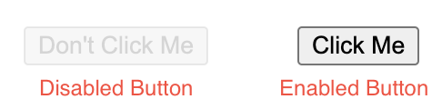

# Pseudo-classes

A pseudo-class is a keyword added to selectors that specifies a special state of the selected element(s). For example, it can be used to style an element when a user hovers over it, or when a user clicks it. CSS pseudo-classes can also be used to allow styling based on elements that are in a certain state, such as being disabled or having been visited before.

In general, what makes a pseudo-class different from a regular class is that classes are used to target specific elements on the page, while pseudo-classes are used to target elements based on their state or position.

A pseudo-class starts with a colon (:) followed by the keyword.

```
selector:pseudo-class {
  /* your style here */
}
```

Some of the most commonly used pseudo-classes are:

| Pseudo-class | Description |
| :---   | :--- | 
| :hover | Used when a user hovers over an element with the mouse pointer. |
| :active	| Used to style an element when it is clicked.
| :focus	| Used to highlight elements when they are selected or focused on by the user.
| :visited	| Used to style elements that have been previously visited.
| :first-child	| Used to style an element that is the first child of its parent element.
| :last-child	| Used to style an element that is the last child of its parent element.
| :not	| Used to target elements that do not match a given selector.
| :enabled	| Used to style an element when it is enabled.
| :disabled	| Used to style an element when it is disabled.

The following example makes use of the `:hover` pseudo-class to change an element from purple with a dotted underline to yellow with a regular underline when a user hovers over it:

```
a {
  color: purple;
  text-decoration: underline dotted;
}
a:hover {
  color: yellow;
  text-decoration: underline;
}
```

Another example would be to style all disabled buttons on the page by using the `:disabled` pseudo-class.

```
button:disabled {
  opacity: 0.5;
}
```

In this example, when a button is disabled, it becomes slightly less visible by reducing its opacity to 50%.

